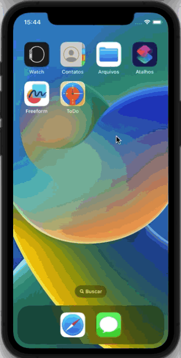

# TODO App

## Description
The main goal of the project is to improve my knowledge of SwiftUI. This application is a simple task manager, where I can use a CRUD

## Screenshots

## Credits

 
  <small> Josileudo Rodrigues - 2023</small>
</div